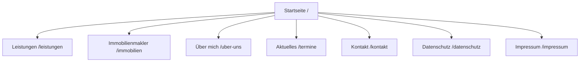
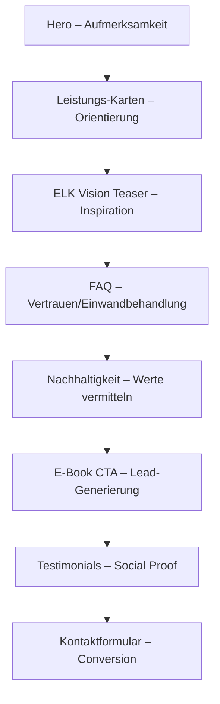
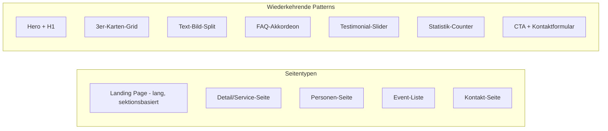

# Analyse – Referenz-Website: wohnen-schaffen.de

> **Analysiert am:** 20.05.2026  
> **URL:** https://www.wohnen-schaffen.de/  
> **Betreiber:** Ronny Bartholdy – Fachberater für Fertighäuser (ELK Fertighaus)  
> **Branche:** Fertighausbau, Bauberatung, Immobilienmakler

---

## 1. Seitenstruktur & Routing

| Route | Seitentitel | Zweck |
|---|---|---|
| `/` | Startseite – Moderne Fertighäuser | Landing Page mit Hero, Leistungsübersicht, FAQ, Nachhaltigkeit, E-Book CTA, Testimonials, Kontaktformular |
| `/leistungen` | Leistungen | Detailseite: Bauberatung & Finanzierung, ELK Fertighäuser, Hausmodelle, Testimonials |
| `/immobilien` | Immobilienmakler | Makler-Dienstleistungen (Seite derzeit nicht erreichbar – 404) |
| `/uber-uns` | Über mich | Persönliche Vorstellung, Qualifikationen, Erfolgsbilanz (Zahlen/Statistiken) |
| `/termine` | Aktuelles & Termine | Event-Kalender (Messen, Hausaufstellungen, Finanzierungstage) |
| `/kontakt` | Kontakt | Kontaktformular, Telefon, Adresse, Karte |
| `/datenschutz` | Datenschutz | Datenschutzerklärung |
| `/impressum` | Impressum | Impressum |

### Sitemap-Diagramm



---

## 2. Komponenten-Mapping

### Globale Komponenten (auf allen Seiten)

| Komponente | Beschreibung |
|---|---|
| **Navigation (Header)** | Sticky Top-Nav mit Logo links, Hauptmenü-Links rechts (Startseite, Leistungen, Immobilienmakler, Über mich, Aktuelles, Kontakt). Mobile: Burger-Menü |
| **Cookie-Banner** | Overlay mit „Alles erlauben / Alles ablehnen / Einstellungen", Link zur Datenschutzerklärung |
| **Footer** | Zweispaltig: Links Navigation (alle Hauptseiten), Rechts rechtliche Links (Datenschutz, Impressum) |
| **CTA-Section (Footer-nah)** | Wiederkehrend: „Sie haben noch Fragen?" + Kontaktformular |

### Seitenspezifische Komponenten

#### Startseite (`/`)

| Komponente | Position | Beschreibung |
|---|---|---|
| **Hero-Section** | Top | Große Headline „Moderne Fertighäuser", Hintergrundbild/Video, ggf. CTA-Button |
| **Leistungs-Karten (3er Grid)** | Nach Hero | Drei Karten: Beratung & Finanzierung, ELK Fertighäuser, Immobilienmakler – jeweils mit Icon, Kurztext, „Mehr erfahren"-Link |
| **ELK Vision Teaser** | Mid | „Erleben Sie Wohnen neu mit ELK Vision" – externer Link zu vision.elk.at |
| **Statistik-Banner** | Mid | „In nur 23 Sekunden wächst das Holz nach" – animierte Zahl / Highlight-Fakt |
| **FAQ-Akkordeon** | Mid-Low | „Häufig gestellte Fragen" – Expandable Items zu Fertighausthemen |
| **CTA-Sektion** | Mid | „Jetzt bauen, kostenloses Erstgespräch" – E-Mail + Telefon Buttons |
| **Nachhaltigkeit-Section** | Mid-Low | 4 Feature-Karten: Natürlich aus Holz, Klimaschützer, Wohlfühlen, Haustechnik |
| **7-Fichten-Statistik** | Low | Illustratives Statistik-Element mit Fakten zum Holzverbrauch |
| **E-Book CTA** | Low | „Kostenloses E-Book" – Teaser + Download-Button |
| **Testimonials-Slider** | Low | Karussell mit Bauherren-Zitaten (Name, Ort) |
| **Kontaktformular** | Bottom | Eingebettetes Formular vor dem Footer |

#### Leistungen (`/leistungen`)

| Komponente | Position | Beschreibung |
|---|---|---|
| **Hero/Intro** | Top | „Wir schaffen Wohnen" + Beschreibungstext |
| **Leistungsbereich: Bauberatung** | Mid | 5 Unterpunkte mit Icons/Überschriften (Finanzberatung, Transparenz, Bedarfsanalyse, Fördermittel, Begleitung) |
| **Leistungsbereich: ELK Fertighäuser** | Mid | 5 Vorteile (Zeit/Sicherheit, Kompetenz, Nachhaltigkeit, Standard, Qualität) |
| **Hausmodell-Karten** | Mid-Low | Grid mit Haustypen: ELK Vision 115, ELK Life 143 SD, Design Bungalow 122, Mehrfamilienhaus – jeweils Bild, qm, Dachtyp, externer Link |
| **Testimonials** | Low | Wiederkehrendes Testimonial-Element |
| **CTA/Kontakt** | Bottom | „Sie haben noch Fragen?" |

#### Über mich (`/uber-uns`)

| Komponente | Position | Beschreibung |
|---|---|---|
| **Hero/Intro** | Top | Persönlicher Vorstellungstext mit Foto |
| **USP-Karten** | Mid | 4 Karten: Positive Resonanzen, Beratung auf Augenhöhe, Warum ich, Fertighausexperte mit Herz |
| **Zweispaltig: Text + Bild** | Mid | „Zusammenarbeit auf Augenhöhe" – persönliche Geschichte |
| **Rollen-Karten** | Mid | Fachberater + Bauherr (zwei Perspektiven) |
| **Zahlen/Statistiken (Counter)** | Low | Animierte Zahlen: Zufriedene Bauherren, Tonnen Holz, Millionen Fördergelder, qm Wohnfläche |
| **CTA/Kontakt** | Bottom | Standard-Kontaktbereich |

#### Aktuelles (`/termine`)

| Komponente | Position | Beschreibung |
|---|---|---|
| **Seiten-Headline** | Top | „Aktuelles & Termine" |
| **Event-Liste** | Main | Chronologische Liste mit: Datum, Titel, Ort, Adresse, ggf. CTA „Terminvereinbarung" |
| **CTA/Kontakt** | Bottom | Standard-Kontaktbereich |

#### Kontakt (`/kontakt`)

| Komponente | Position | Beschreibung |
|---|---|---|
| **Kontakt-Hero** | Top | „KontaktDaten" mit Telefonnummer + E-Mail-Link |
| **Kontaktformular** | Mid | Formularfelder (Name, E-Mail, Nachricht, Datenschutz-Checkbox) |
| **Karte/Adresse** | Mid-Low | Adresse: König-Wilhelm-Straße 6, 74360 Ilsfeld |

---

## 3. Content-Struktur pro Seite

### Inhaltstypen-Matrix

| Seite | Headline | Subline | Fließtext | Bulletpoints | Bilder | Formular | Karten | Statistiken | FAQ |
|---|---|---|---|---|---|---|---|---|---|
| `/` | ✅ | ✅ | ✅ | ❌ | ✅ | ✅ | ✅ | ✅ | ✅ |
| `/leistungen` | ✅ | ✅ | ✅ | ✅ (als H3-Liste) | ✅ | ✅ | ✅ | ❌ | ❌ |
| `/uber-uns` | ✅ | ✅ | ✅ | ❌ | ✅ | ✅ | ✅ | ✅ | ❌ |
| `/termine` | ✅ | ❌ | ❌ | ❌ | ❌ | ✅ | ❌ | ❌ | ❌ |
| `/kontakt` | ✅ | ✅ | ❌ | ❌ | ❌ | ✅ | ❌ | ❌ | ❌ |

### Content-Hierarchie (typisch pro Sektion)

```
H1 – Seiten-Headline (1x pro Seite)
  H2 – Sektions-Headline
    H3 – Feature/Punkt-Headline
      p – Beschreibungstext
      a – CTA-Link / Button
```

---

## 4. Design-Patterns

### Farbschema (geschätzt aus visueller Analyse)

| Rolle | Farbe (geschätzt) | Verwendung |
|---|---|---|
| **Primär** | Dunkelgrün / Waldgrün | Headlines, Buttons, Akzente |
| **Sekundär** | Warmweiß / Creme | Hintergründe |
| **Akzent** | Gold / Bernstein | CTAs, Hover-States |
| **Text** | Dunkelgrau / Fast-Schwarz | Fließtext |
| **Hintergrund** | Weiß + helles Grau | Sektions-Wechsel |

### Typografie-Hierarchie

| Element | Stil |
|---|---|
| H1 | Groß, Bold, vermutlich Serif oder Display-Font |
| H2 | Mittelgroß, Semi-Bold |
| H3 | Klein-Mittel, Semi-Bold |
| Body | Sans-Serif, Regular, ~16px Basis |
| CTA-Buttons | Uppercase oder Semi-Bold, abgerundet |

### Layout-Grid

- **Max-Width Container:** ~1200px (zentriert)
- **Grid-System:** Primär 2- und 3-Spalten-Layouts für Karten
- **Spacing:** Großzügiges vertikales Spacing zwischen Sektionen (~80–120px), moderate Padding in Cards (~24–32px)
- **Sektions-Wechsel:** Alternierende Hintergrundfarben (Weiß ↔ Hellgrau/Creme)

### Animationen

- Scroll-triggered Fade-In für Sektionen
- Counter-Animation bei Statistik-Zahlen (Über-mich-Seite)
- Hover-Effekte auf Karten und Buttons (Scale/Shadow)
- FAQ-Akkordeon mit Slide-Down-Animation

---

## 5. UX-Flow

### Nutzerführung (Startseite)



### CTA-Strategie

| CTA-Typ | Platzierung | Ziel |
|---|---|---|
| „Mehr erfahren" | Leistungs-Karten | Interne Navigation zu Detailseiten |
| „Kostenloses Erstgespräch" | Mid-Page | Terminvereinbarung (Telefon/E-Mail) |
| „Zum kostenlosen E-Book" | Lower-Page | Lead-Magnet Download |
| „Kontaktieren Sie uns" | Jede Seite (Bottom) | Formular-Submission |

### Navigation-Pattern

- **Primär:** Horizontale Top-Navigation (Desktop), Burger-Menü (Mobile)
- **Sekundär:** Footer-Navigation mit allen Links
- **In-Page:** „Mehr erfahren"-Links als sekundäre Navigation
- **Kein Mega-Menü** – flache Hierarchie, alle Seiten auf einer Ebene

### Scroll-Verhalten

- Long-Scroll Startseite mit mehreren Sektionen
- Keine Anchor-Links / Scroll-to-Section
- Sticky Header für permanente Navigation
- Kein Parallax (Performance-orientiert)

---

## 6. Technische Hinweise

### Erkennbare Technologien

| Bereich | Technologie |
|---|---|
| **CMS/Builder** | Vermutlich Webflow oder ähnlicher No-Code Builder (basierend auf URL-Struktur und Markup-Patterns) |
| **Hosting** | Wahrscheinlich Webflow Hosting oder CDN |
| **Cookie-Management** | Custom Cookie-Banner (Alles erlauben/ablehnen/Einstellungen) |
| **Formulare** | Eingebettete Formulare (vermutlich Webflow Forms oder externes Tool) |
| **Externe Links** | vision.elk.at, elkhaus.de (Partnerseiten) |

### SEO-Struktur

| Element | Status |
|---|---|
| **Title-Tags** | ✅ Vorhanden, seitenspezifisch (z.B. „Ronny Bartholdy – Fachberater für Fertighäuser von ELK Fertighaus") |
| **H1-Struktur** | ✅ Eine H1 pro Seite |
| **Meta-Description** | Vermutlich vorhanden (nicht aus Scrape ersichtlich) |
| **Semantische URLs** | ✅ Sprechende Pfade (`/leistungen`, `/uber-uns`, `/kontakt`) |
| **Interne Verlinkung** | ✅ Gut – alle Seiten über Nav + Footer verlinkt |
| **Externe Links** | Zu ELK-Partnerseiten (vision.elk.at, elkhaus.de) |
| **Sitemap** | Wahrscheinlich vorhanden (Standard bei Webflow) |
| **Structured Data** | Nicht erkennbar aus Scrape |

### Performance-Patterns

- Relativ schlanke Seitenstruktur (wenige Unterseiten)
- Bilder vermutlich über CDN ausgeliefert
- Kein erkennbares JavaScript-Framework (kein React/Vue/Angular) – wahrscheinlich statisch generiert
- Cookie-Banner als Overlay (kein Third-Party-Script wie Cookiebot erkennbar)

---

## 7. Mobile-Analyse

### Responsive-Verhalten (abgeleitet aus Struktur)

| Breakpoint | Verhalten |
|---|---|
| **Mobile (<768px)** | Einspaltiges Layout, Burger-Menü, gestapelte Karten, verkleinerte Headlines |
| **Tablet (768–1024px)** | 2-Spalten-Grid für Karten, Navigation evtl. noch Burger |
| **Desktop (>1024px)** | Volle horizontale Navigation, 3-Spalten-Grids, großzügiges Spacing |

### Mobile Navigation-Pattern

- **Burger-Menü** (Hamburger-Icon) im Header
- Vermutlich **Fullscreen-Overlay** oder **Slide-In Drawer** bei Klick
- Alle Hauptseiten im mobilen Menü verfügbar

### Mobile-spezifische Anpassungen (erwartet)

- Größere Touch-Targets für CTAs
- Vereinfachte FAQ-Darstellung (volle Breite)
- Testimonial-Slider: Swipe statt Pfeile
- Kontaktformular: Volle Breite, optimierte Input-Größen
- Statistik-Counter: Untereinander statt nebeneinander

---

## 8. Zusammenfassung & Key Takeaways

### Stärken der Referenz-Website

1. **Klare Nutzerführung** – Von Information → Vertrauen → Conversion
2. **Starker Social Proof** – Testimonials auf fast jeder Seite
3. **Lead-Magnets** – Kostenloses E-Book als niedrigschwelliger Einstieg
4. **Persönliche Marke** – „Über mich" statt anonymes Unternehmen
5. **Wiederkehrende CTAs** – Kontaktmöglichkeit auf jeder Seite
6. **Nachhaltigkeits-Storytelling** – Emotionale Fakten (7 Fichten, 23 Sekunden)

### Schwächen / Verbesserungspotential

1. `/immobilien` nicht erreichbar (404) – Broken Link in Navigation
2. Keine erkennbare Blog-/Content-Strategie für SEO
3. Termine-Seite mit vergangenen Events (keine automatische Archivierung)
4. Keine erkennbare Suchfunktion
5. Kein erkennbares Chatbot/Live-Chat Feature

### Design-Pattern-Zusammenfassung für Nachbau


