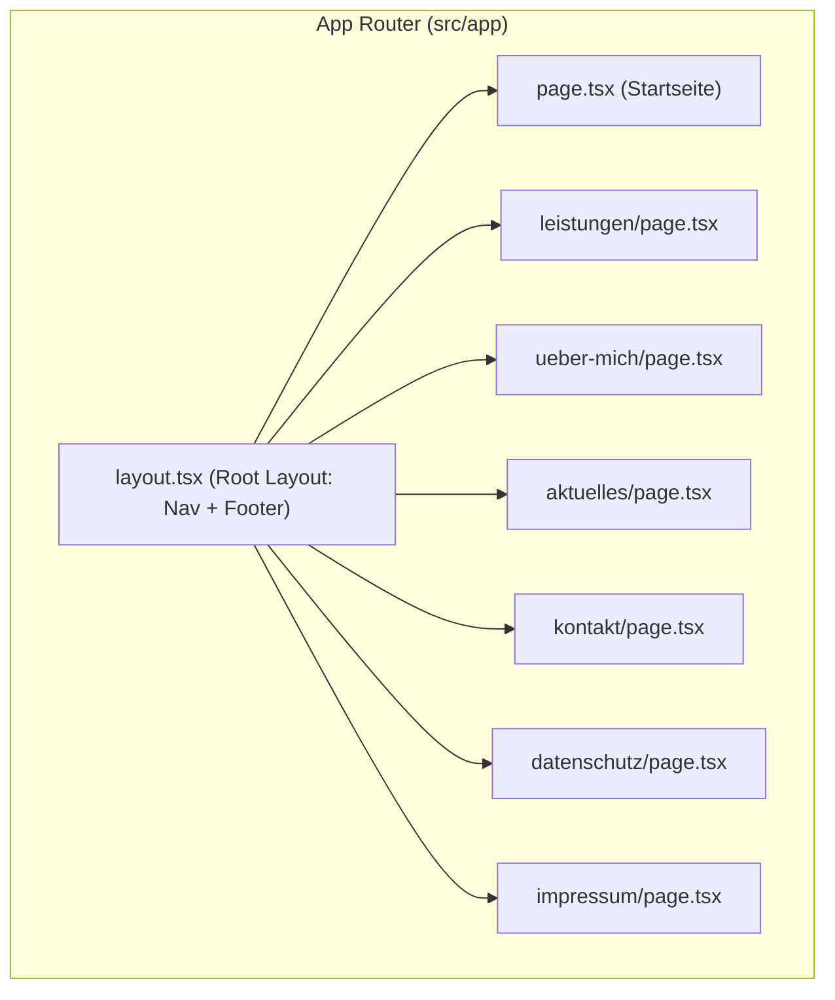

# Projekt-Dokumentation: website-michael-wiggenhauser

---

## 2.1 Projektübersicht

| Feld | Beschreibung |
|---|---|
| **Projektname** | website-michael-wiggenhauser |
| **Kurzbeschreibung** | Persönliche Website für Michael Wiggenhauser – selbstständiger Handelsvertreter und Fachberater für ELK Fertighäuser. Bauberatung, Finanzierungsbegleitung und individuelle Hausbauplanung. |
| **Zielgruppe** | Menschen, die ein Fertighaus bauen lassen wollen – Familien, Paare, Bauherren in der Planungsphase |
| **Branche** | Fertighausbau (ELK), Bauberatung, Handelsvertretung |
| **Geschäftsmodell** | Lead-Generierung → Erstgespräch → Beratung → Hausbau-Abschluss über ELK |

### Tech-Stack Übersicht

| Bereich | Technologie |
|---|---|
| Framework | Next.js (App Router) |
| Styling | Tailwind CSS |
| Sprache | TypeScript |
| Testing | Jest + React Testing Library, Playwright |
| Linting | ESLint + Prettier |
| VCS | Git + GitHub |
| CI/CD | GitHub Actions |
| Hosting | Vercel (empfohlen) |

---

## 2.2 Tech-Stack (Detail)

| Bereich | Technologie | Version | Begründung |
|---|---|---|---|
| **Framework** | Next.js (App Router) | 14.x (stable) | SSR/SSG, optimale SEO, Image-Optimierung, native Vercel-Integration |
| **Styling** | Tailwind CSS | 3.x | Utility-First, Mobile-First, schnelle Iteration |
| **Sprache** | TypeScript | 5.x | Typsicherheit, bessere DX, weniger Bugs |
| **UI-Komponenten** | shadcn/ui (optional) | latest | Zugängliche, anpassbare Basiskomponenten |
| **Icons** | Lucide React | latest | Leichtgewichtig, konsistente Icon-Library |
| **Animationen** | Framer Motion | latest | Scroll-Animationen, Counter, Transitions |
| **Testing (Unit)** | Jest + React Testing Library | latest | Standardtool für React-Komponenten |
| **Testing (E2E)** | Playwright | latest | Cross-Browser, zuverlässig |
| **Linting** | ESLint + Prettier | latest | Code-Qualität + konsistente Formatierung |
| **VCS** | Git + GitHub | – | Standard, CI/CD-Integration |
| **CI/CD** | GitHub Actions | – | Kostenlos für Open Source, native GitHub-Integration |
| **Hosting** | Vercel | – | Zero-Config für Next.js, Preview Deployments |

---

## 2.3 Design-Prinzipien

### Mobile-First

Alle Komponenten werden zuerst für mobile Viewports (< 640px) entwickelt, dann progressiv für Tablet und Desktop erweitert.

### Responsive Breakpoints (Tailwind-Defaults)

| Breakpoint | Prefix | Min-Width |
|---|---|---|
| Mobile | (default) | 0px |
| Small | `sm:` | 640px |
| Medium | `md:` | 768px |
| Large | `lg:` | 1024px |
| Extra Large | `xl:` | 1280px |
| 2XL | `2xl:` | 1536px |

### Weitere Prinzipien

- **Semantisches HTML** – Korrekte Heading-Hierarchie, Landmarks, ARIA-Attribute
- **Accessibility** – WCAG 2.1 AA konform (Kontraste, Fokus-Management, Screen-Reader)
- **Performance** – Core Web Vitals optimiert (LCP < 2.5s, FID < 100ms, CLS < 0.1)
- **SEO** – Strukturierte Daten, Meta-Tags, Open Graph, semantische URLs
- **Komponentenbasiert** – Wiederverwendbare, isolierte UI-Bausteine

---

## 2.4 Seitenstruktur & Routing

### Routen

| Route | Seite | Haupt-Komponenten | Content-Beschreibung |
|---|---|---|---|
| `/` | Startseite | Hero, LeistungsKarten, ELKVisionTeaser, FAQAccordion, NachhaltigkeitSection, EBookCTA, Testimonials, KontaktFormular | Landing Page – Aufmerksamkeit → Vertrauen → Conversion |
| `/leistungen` | Leistungen | HeroSection, BauberatungSection, FertighausSection, HausmodellGrid, Testimonials, KontaktCTA | Detaillierte Service-Beschreibung |
| `/ueber-mich` | Über mich | HeroMitBild, USPKarten, PersoenlicheGeschichte, RollenKarten, StatistikCounter, KontaktCTA | Persönliche Marke + Vertrauen |
| `/aktuelles` | Aktuelles & Termine | SeitenHeadline, EventListe, KontaktCTA | Events, Messen, Finanzierungstage |
| `/kontakt` | Kontakt | KontaktHero, KontaktFormular, KarteAdresse | Direkte Kontaktmöglichkeit |
| `/datenschutz` | Datenschutz | ProseContent | Rechtlich erforderlich |
| `/impressum` | Impressum | ProseContent | Rechtlich erforderlich |

### Routing-Diagramm



---

## 2.5 Komponentenarchitektur

### Atomic Design Hierarchie

```
Atoms        → Button, Badge, Input, Label, Icon, Heading, Text
Molecules    → Card, FormField, NavLink, TestimonialCard, EventCard, StatCounter
Organisms    → Navbar, Footer, Hero, FAQAccordion, TestimonialSlider, KontaktFormular, LeistungsGrid
Templates    → PageLayout, SectionLayout
Pages        → Startseite, Leistungen, Über mich, Aktuelles, Kontakt
```

### Verzeichnisstruktur

```
src/
├── app/
│   ├── layout.tsx                  # Root Layout (Nav + Footer + Fonts)
│   ├── page.tsx                    # Startseite
│   ├── globals.css                 # Tailwind Directives + globale Styles
│   ├── leistungen/
│   │   └── page.tsx
│   ├── ueber-mich/
│   │   └── page.tsx
│   ├── aktuelles/
│   │   └── page.tsx
│   ├── kontakt/
│   │   └── page.tsx
│   ├── datenschutz/
│   │   └── page.tsx
│   └── impressum/
│       └── page.tsx
├── components/
│   ├── ui/                         # Atoms (Button, Input, Badge, etc.)
│   │   ├── button.tsx
│   │   ├── input.tsx
│   │   ├── label.tsx
│   │   ├── badge.tsx
│   │   ├── heading.tsx
│   │   └── card.tsx
│   ├── layout/                     # Layout-Komponenten
│   │   ├── navbar.tsx
│   │   ├── footer.tsx
│   │   ├── mobile-menu.tsx
│   │   ├── section.tsx
│   │   └── container.tsx
│   ├── sections/                   # Sektions-Komponenten (Organisms)
│   │   ├── hero.tsx
│   │   ├── leistungs-karten.tsx
│   │   ├── elk-vision-teaser.tsx
│   │   ├── faq-accordion.tsx
│   │   ├── nachhaltigkeit-section.tsx
│   │   ├── ebook-cta.tsx
│   │   ├── testimonial-slider.tsx
│   │   ├── statistik-counter.tsx
│   │   ├── kontakt-formular.tsx
│   │   ├── kontakt-cta.tsx
│   │   ├── bauberatung-section.tsx
│   │   ├── fertighaus-section.tsx
│   │   ├── hausmodell-grid.tsx
│   │   ├── event-liste.tsx
│   │   ├── usp-karten.tsx
│   │   └── rollen-karten.tsx
│   └── shared/                     # Wiederverwendbare Molecules
│       ├── testimonial-card.tsx
│       ├── event-card.tsx
│       ├── feature-card.tsx
│       ├── stat-counter.tsx
│       └── cta-button.tsx
├── lib/
│   ├── placeholder-data.ts         # Dummy-Inhalte als Konstanten
│   ├── utils.ts                    # Utility-Funktionen (cn, etc.)
│   └── constants.ts                # Seitenkonstanten (Navigation, Meta)
├── types/
│   └── index.ts                    # Shared TypeScript Interfaces
└── public/
    ├── images/                     # Statische Bilder
    └── fonts/                      # Custom Fonts (falls nötig)
```

---

## 2.6 KI-Arbeitsanweisungen

> Dieser Abschnitt dient als **Leitfaden für KI-Assistenten**, die am Projekt mitarbeiten.

### Code-Standards

- Jede Komponente erhält eine eigene Datei
- **Naming:** PascalCase für Komponenten (`HeroSection`), kebab-case für Dateien/Ordner (`hero-section.tsx`)
- Tailwind-Klassen direkt im JSX, keine separaten CSS-Dateien (außer `globals.css`)
- Dummy-Inhalte werden als Konstanten in `/lib/placeholder-data.ts` gepflegt
- Jede neue Seite/Komponente erhält mindestens einen Unit-Test
- Commits folgen **Conventional Commits** (`feat:`, `fix:`, `docs:`, `chore:`, `style:`, `test:`)

### Verbote

- ❌ Keine Inline-Styles
- ❌ Kein `!important`
- ❌ Keine CSS-Module oder Styled Components
- ❌ Keine `any`-Types in TypeScript
- ❌ Keine relativen Imports über mehr als 2 Ebenen (Alias `@/` nutzen)

### Responsive-Klassen

Immer Mobile-First:

```tsx
className="text-sm md:text-base lg:text-lg"
className="grid grid-cols-1 md:grid-cols-2 lg:grid-cols-3"
className="px-4 md:px-8 lg:px-16"
```

### Bilder

- Immer Next.js `<Image>` Komponente verwenden
- Explizite `width` und `height` Angaben
- `alt`-Text für jedes Bild (Accessibility)
- Responsive Sizes mit `sizes` Attribut

### Komponenten-Struktur (Template)

```tsx
// src/components/sections/example-section.tsx
import { FC } from "react";

interface ExampleSectionProps {
  title: string;
  description?: string;
}

const ExampleSection: FC<ExampleSectionProps> = ({ title, description }) => {
  return (
    <section className="py-16 md:py-24">
      <div className="container mx-auto px-4">
        <h2 className="text-2xl md:text-3xl lg:text-4xl font-bold">
          {title}
        </h2>
        {description && (
          <p className="mt-4 text-gray-600">{description}</p>
        )}
      </div>
    </section>
  );
};

export default ExampleSection;
```

---

## 2.7 Testing-Strategie

### Testpyramide

```
        ╱ E2E (Playwright) ╲         → Kritische User-Journeys
       ╱  Integration Tests  ╲       → Seitenlevel-Rendering
      ╱   Unit Tests (Jest)    ╲     → Komponenten, Utilities
     ━━━━━━━━━━━━━━━━━━━━━━━━━━━━
```

### Unit-Tests (Jest + React Testing Library)

- Jede UI-Komponente: Rendering, Props, Conditional Rendering
- Utility-Funktionen in `/lib/`
- Snapshot-Tests für stabile Komponenten

### Integration-Tests

- Seitenlevel-Rendering (jede Route rendern)
- Formular-Flows (Validierung, Submission)
- Navigation-Verhalten

### E2E-Tests (Playwright)

- **Navigation:** Alle Hauptseiten erreichbar
- **CTA-Klicks:** Buttons führen zum richtigen Ziel
- **Kontaktformular:** Ausfüllen + Absenden
- **Responsive:** Tests auf Mobile + Desktop Viewport
- **Accessibility:** axe-core Integration

### Coverage-Ziel

- **Minimum:** ≥ 80% Line Coverage
- **Kritische Pfade:** 100% (Kontaktformular, Navigation)

### Testdatei-Konvention

```
src/components/sections/hero.tsx          → Komponente
src/components/sections/__tests__/hero.test.tsx  → Test
```

---

## 2.8 CI/CD-Pipeline

### Branch-Modell

```
main (Production) ← PR + Review + Tests grün
  ↑
develop (Dev/Staging) ← PR + Tests grün
  ↑
feature/* / fix/* (Branches)
```

### GitHub Actions Workflows

#### `ci.yml` – Auf jedem PR

```yaml
Trigger: Pull Request → main, develop
Steps:
  1. Checkout
  2. Node.js Setup (LTS)
  3. Install Dependencies (npm ci)
  4. Lint (ESLint + Prettier Check)
  5. Type Check (tsc --noEmit)
  6. Unit Tests (Jest --coverage)
  7. Build Check (next build)
  8. E2E Tests (Playwright)
```

#### `deploy-dev.yml` – Push auf `develop`

```yaml
Trigger: Push → develop
Steps:
  1. CI Steps (Lint, Test, Build)
  2. Deploy → Vercel Preview (automatisch via Vercel Git Integration)
```

#### `deploy-prod.yml` – Release-Tag

```yaml
Trigger: Tag v*.*.*
Steps:
  1. CI Steps (Lint, Test, Build)
  2. Deploy → Vercel Production
```

---

## 2.9 Git-Branching-Strategie

| Branch | Zweck | Deploy-Ziel |
|---|---|---|
| `main` | Production-ready Code | Vercel Production |
| `develop` | Integrationsbranch | Vercel Preview |
| `feature/<name>` | Neue Features | – (PR nach develop) |
| `fix/<name>` | Bugfixes | – (PR nach develop) |

### Commit-Konvention (Conventional Commits)

```
feat: Neue FAQ-Sektion auf Startseite
fix: Mobile-Menü schließt nicht bei Link-Klick
docs: README aktualisiert mit Setup-Anleitung
style: Spacing in Hero-Section angepasst
test: Unit-Tests für Kontaktformular
chore: Abhängigkeiten aktualisiert
refactor: Navbar-Komponente vereinfacht
```

### Release-Workflow

1. Feature-Branches → PR nach `develop`
2. Nach QA auf develop: PR nach `main`
3. Merge in `main` → GitHub Release erstellen mit Tag `v1.0.0`
4. Tag triggert Production-Deployment

---

## 2.10 Hosting-Empfehlung

### Vergleich

| Anbieter | Dev-Server | Prod-Server | Kosten (geschätzt) | Next.js Support |
|---|---|---|---|---|
| **Vercel** | Preview Deployments (auto) | Production (auto) | Free Tier / ~$20/mo Pro | Nativ, erstklassig |
| **Cloudflare Pages** | Preview Branches | Production | Free Tier großzügig | Gut (via @cloudflare/next-on-pages) |
| **AWS Amplify** | Branch-Deployments | Production | ~$0–5/mo bei wenig Traffic | Gut |
| **Hetzner + Docker** | Eigener VPS | Eigener VPS | ~€4–8/mo | Volle Kontrolle, mehr Setup |
| **Railway** | Environments | Production | ~$5/mo | Gut |

### Empfehlung

> **Für den Start: Vercel (Free Tier)**
> - Zero-Config für Next.js
> - Automatische Preview-Deployments pro Branch = Dev-Server out-of-the-box
> - Keine Server-Administration nötig
> - Großzügiger Free Tier (100GB Bandwidth, Serverless Functions)
> - Wechsel zu Hetzner/AWS erst bei Skalierungsbedarf oder Kostenoptimierung

> **Budget-Alternative: Hetzner Cloud (~€4/mo)**
> - CX22 VPS mit Docker + Traefik
> - Volle Kontrolle, langfristig am günstigsten
> - Mehr initialer Setup-Aufwand
> - Sinnvoll ab höherem Traffic oder wenn mehrere Projekte gehostet werden

---

## Anhang: Tailwind Custom-Theme (Vorschlag)

Basierend auf der Analyse der Referenz-Website:

```js
// tailwind.config.ts (Auszug)
theme: {
  extend: {
    colors: {
      primary: {
        50: '#f0fdf4',
        100: '#dcfce7',
        500: '#22c55e',
        600: '#16a34a',
        700: '#15803d',
        800: '#166534',
        900: '#14532d',
      },
      accent: {
        400: '#fbbf24',
        500: '#f59e0b',
        600: '#d97706',
      },
    },
    fontFamily: {
      sans: ['var(--font-inter)', 'system-ui', 'sans-serif'],
      display: ['var(--font-display)', 'serif'],
    },
    container: {
      center: true,
      padding: {
        DEFAULT: '1rem',
        sm: '2rem',
        lg: '4rem',
        xl: '5rem',
      },
    },
  },
}
```

> **Hinweis:** Farben und Fonts werden in Phase 3 nach Abstimmung mit dem konkreten Branding von Michael Wiggenhauser finalisiert.
